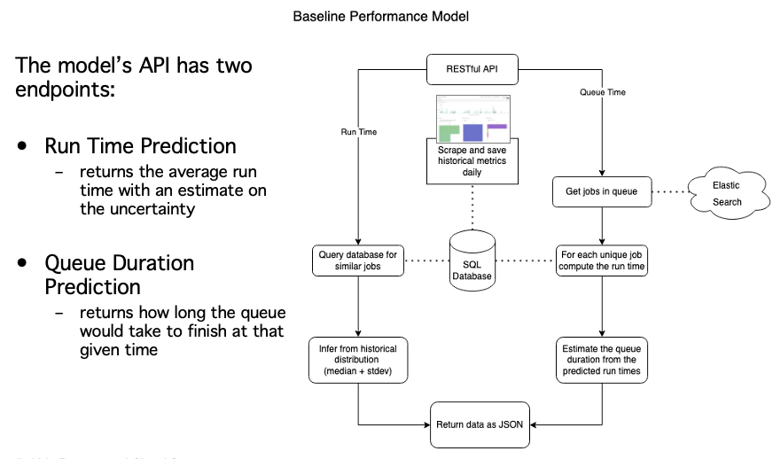
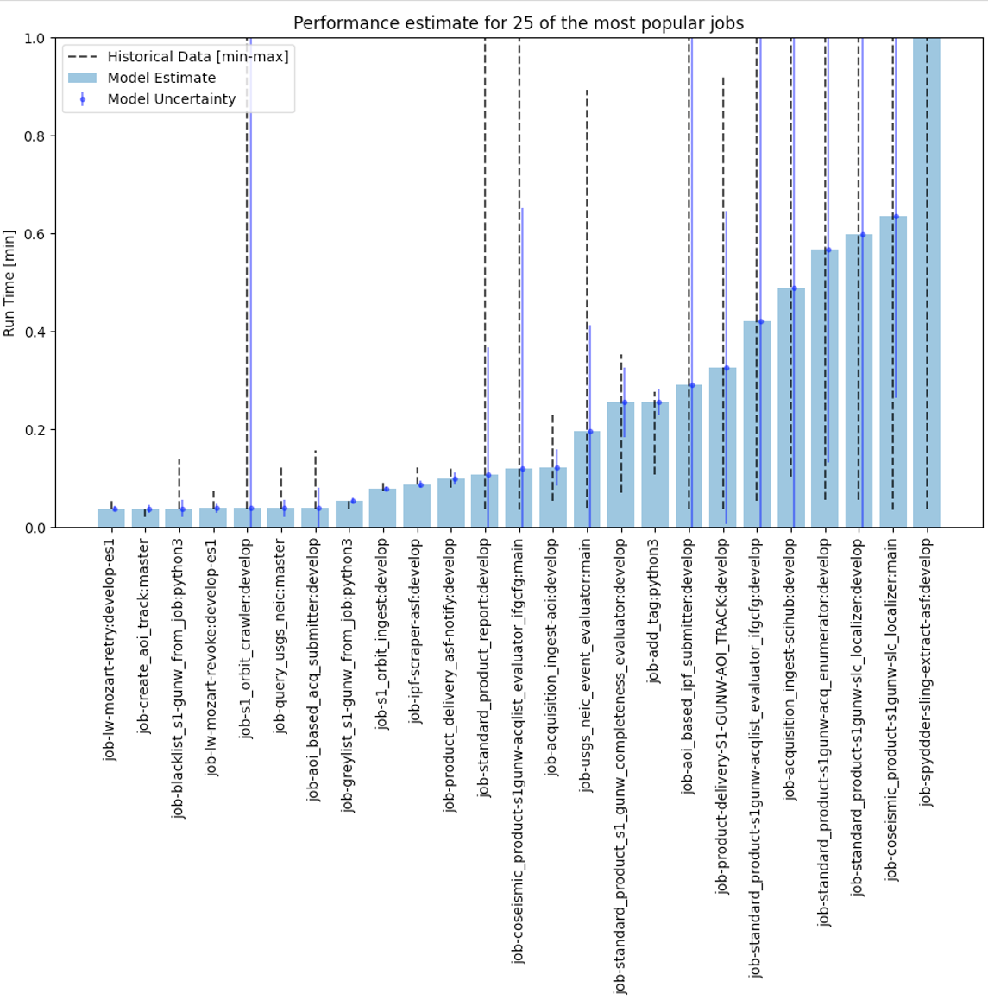
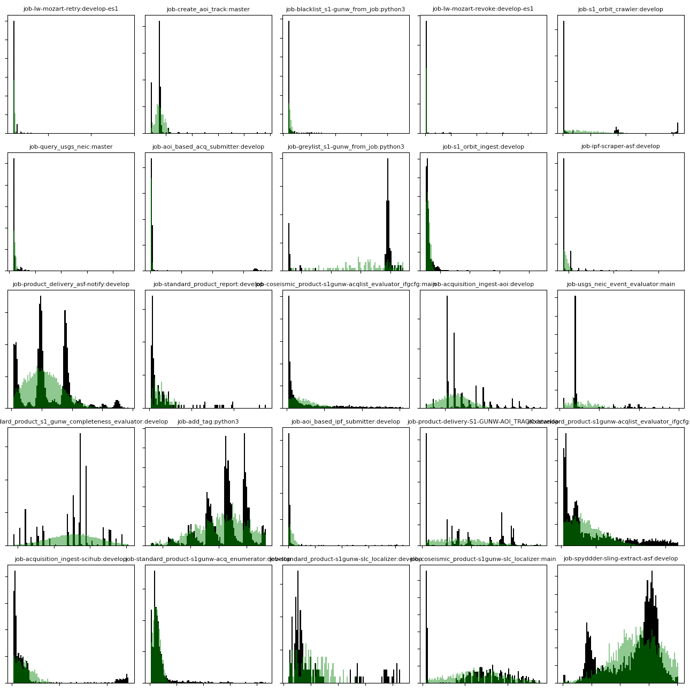
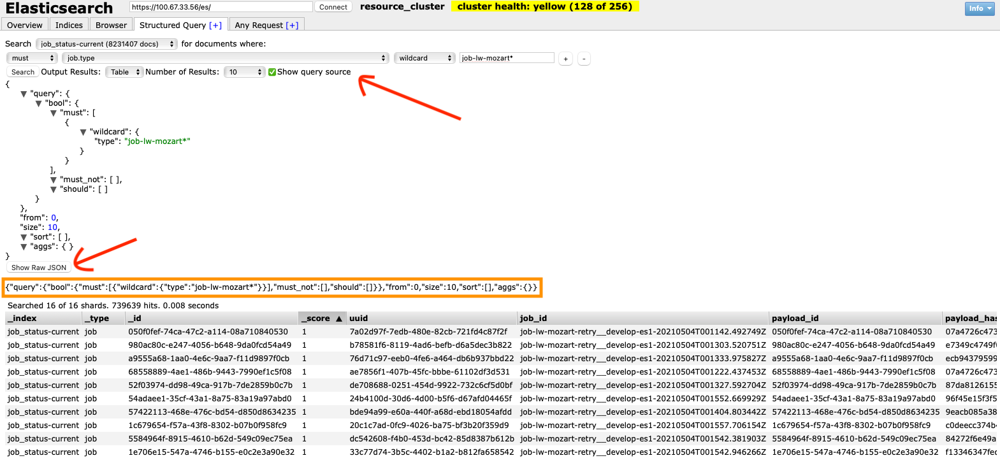

# Smart On-Demand Multi-cloud Performance Estimator

A model for estimating the time to completion and cost of completion for various processing jobs on clusters leveraging historic data from the hybrid cloud science data system (HySDS). The model comes with a flask application and can be easily accessed over the web via a RESTful interface. A few features include:

- Estimate a job's run time
- Predict a job's cost
- Calculate how long the queue will take
- Update the model daily for better predictions



## Dependencies
- Python 3 & Anaconda

`conda env create -f environment.yml`

`conda activate soamc`

## Starting the web server

The model is deployed using a web server with various endpoints that return metrics or predictions.

To start the server: `python webserver.py` 

Then open a web browser and navigate to some of the URLs below

###  `/runtime`
Args:
- jobtype
- instance

Example:

`http://127.0.0.1:5000/runtime?jobtype=job-ipf-scraper-asf:develop&instance=c5.9xlarge`

Output:
```
{
    "name": "job-standard-product-s1gunw-topsapp:develop", 
    "instance": "c5.9xlarge", 
    "mean": "4885.25", 
    "stdev": "859.51", 
    "units": "seconds"
}
```
---


###  `/runcost`
Args:
- jobtype
- instance

Example:

`http://127.0.0.1:5000/runcost?jobtype=job-ipf-scraper-asf:develop&instance=c5.9xlarge`

Output:
```
{
    "name": "job-standard-product-s1gunw-topsapp:develop", 
    "instance": "c5.9xlarge", 
    "mean": "4885.25", 
    "stdev": "859.51", 
    "units": "USD"
}
```
---

###  `/queuetime`
Args:
- size
- nodes

Example:

`http://127.0.0.1:5000/queuetime?size=1000&nodes=5`

Output:
```
qdata = {
    'name': 'Queue Time Estimate',
    'njobs': 3056,
    'min': 13.411,
    'max': 20.796,
    'units': 'day'
}
```

The webserver has a few other command line arguments to change the port or host ip

```
webserver.py [-h] [--host HOST] [--port PORT] [--debug]

Smart on demand analysis of multi-cloud performance model

optional arguments:
  -h, --help   show this help message and exit
  --host HOST  Hostname or IP address
  --port PORT  https server port
  --debug      Debug mode
```

## Model Prediction

Smart on-demand multi-cloud performance estimation involves predicting a job’s run time and using that to estimate the time to completion based on jobs in a queue. Those metrics can then be incorporated to improve user experience and provide real-time estimates when users submit jobs. The initial model is trained using ~500,000 samples from a legacy database containing rich metadata on successfully completed jobs from the ADES clusters. The meta data tracks information like which hardware the job ran on and how long it was in the queue and took to process. Due to the large volume of historical data we can leverage nearest neighbor regression to predict the average run-time and variance from a statistical sample (100-1000). That sample conditions the network's predictions when a new job with similar metrics and inputs needs a prediction. 



A nearest neighbor model is well suited for distinguishing clusters e.g. predicting the same job but for different instances. The model can also fine tune it’s predictions on a daily basis by adding new metrics of recently completed jobs into the model’s database. Adding a temporal update is important for predicting new jobs not seen in the historical set of metrics and due to the limitations of our model it is difficult to extrapolate into an unknown cluster without encoding the metadata e.g. using an autoencoder and latent space. The model code is located in the file: `model.py`. Below is a comparison of the model's predictions compared to the historical distributions of run times for the same instance (aws c5.9xlarge): 



The jobs with multiple modes are the result of the same job but with different input parameters (e.g. squares of long and lat or different sections of a timeseries). The baseline model implements a nearest neighbor search over two parameters currently, the instance type and job type. This can be expanded in the future to include the input parameters for the job and more low level metrics regarding the machine processing the job (e.g. input/output rates, quantity of data). 

## Temporal Updates

The model is capable of updating it's predictions in real-time using the script: `update.py`. The script will scrape the elastic search endpoint for jobs that have successfully completed and add any non-duplicates to the model's internal state (stored via a SQL database). The model's webserver can also trigger updating by spawning a background process once going to the `/update` endpoint. The server is smart enough to only launch one process when updating the model and won't duplicate if one is already running. This code could be optimized by running the update script as a job and having the new model state be stored in the cloud (e.g. s3 bucket). 

## Historic Metrics

The training data for the model comes from historic metrics that are accessible with an elastic search (es). In order to build an es query in python navigate to the `Structured Query` tab and fill in some query data line in the image below and click search



Click on a few buttons indicated with the red arrows and you'll be presented with some text you can copy and paste into python

```python
# build query
query = {"query":{"bool":{"must":[{"wildcard":{"type":"*"}},{"match":{"status":"job-queued"}}],
         "must_not":[],"should":[]}},"from":0,"size":size,"sort":[{"@timestamp":{"order":"asc"}}],"aggs":{}}

# query for jobs queued
endpoint = os.path.join("https://100.67.33.56/es/", "job_status-current/_search")

res = requests.post(endpoint, data=json.dumps(query), 
                    verify=False)
```

To create a back up of the historical metrics run the script: `update.py` with the argument on mode for `historical` - change the es endpoint and version number to switch between elastic search endpoints. 


## Contact

This ETC model was developed by Kyle Pearson: <kyle.a.pearson@jpl.nasa.gov>
